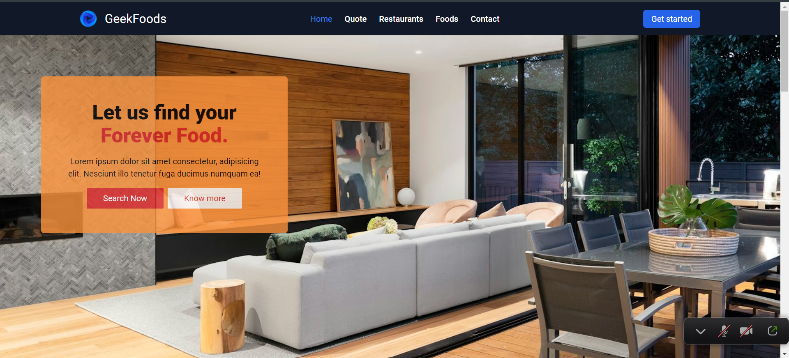

# M5React - Day3 Classwork homepageGeekfood

## Hosted Version of the Project:
[m5react-day3classwork-homepage-geekfood](https://alex21c.github.io/m5react-day3classwork-homepage-geekfood/)

## Objective
In this project, i will embark on the creative process of building a Home Page for "Geek Food" using `ReactJS`. The Home Page serves as the digital front door of the Geek Food brand, and it is where users will have their first interaction with the website. i will construct various sections, including a navigation bar, hero section, card section, and footer, all crafted with `ReactJS` for a seamless and visually appealing user experience.

## How to install and run on yours local machine
`npm install`
`npm run`

## Tech. Stack Used:
+ [React](https://react.dev/)
+ [Google Fonts](https://fonts.google.com/)
+ [Font Awesome](https://fontawesome.com/icons/)

## Author
[Abhishek kumar](https://www.linkedin.com/in/alex21c/), ([Geekster](https://geekster.in/) MERN Stack FS-14 Batch)

